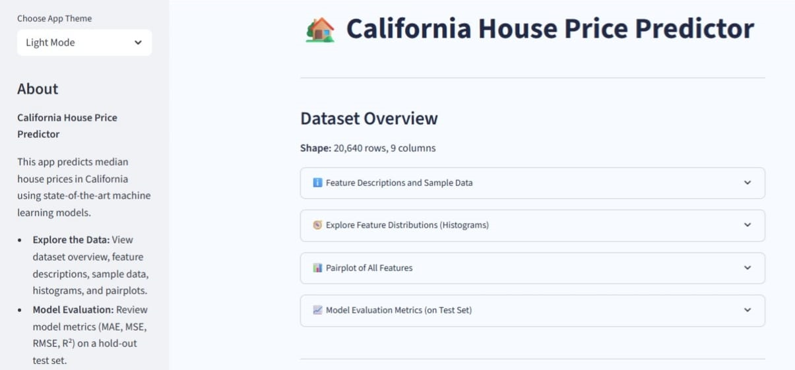

# California House Price Predictor

## Project Summary

This project delivers an interactive, data-driven web application for predicting California median house prices using advanced supervised machine learning models. Built with Python and Streamlit, the app utilizes the classic California Housing dataset from scikit-learn, empowering users to explore, evaluate, predict, and interpret real estate prices with transparency and ease.

**Key Highlights:**
- Supports **Linear Regression** and **Random Forest** models (Random Forest tuned via GridSearchCV)
- In-depth exploratory data analysis: feature info, dataset shape, histograms, and full-feature pairplots
- Honest model validation with MAE, MSE, RMSE, and R² reported on a hold-out test set
- User-friendly prediction form with instant results
- Full interpretability: feature importance chart and individualized SHAP value visualization (for Random Forest)
- Downloadable reports (PDF and CSV)
- Theme customization (light/dark mode)

## How to Run and Use the Streamlit App

1. **Clone or download the project code.**

2. **Install required dependencies:**
   ```
   pip install -r requirements.txt
   ```
   _Or, individually:_
   ```
   pip install streamlit scikit-learn pandas numpy matplotlib seaborn shap fpdf joblib
   ```

3. **Ensure the following files are in your project directory:**
   - `linreg_model.joblib` (Linear Regression model)
   - `rf_model.joblib` (Random Forest model, tuned with GridSearchCV)
   - `scaler.joblib` (feature scaler)
   - `rf_importances.npy` (Random Forest feature importances)
   - `background_scaled.npy` (background dataset for SHAP)

4. **Run the app locally:**
   ```
   streamlit run app.py
   ```

5. **Features and Usage:**
   - **Data Exploration:** See dataset shape, feature descriptions, sample data, interactive histograms, and all-feature pairplots (sampled for speed).
   - **Model Evaluation:** Review side-by-side regression metrics (MAE, MSE, RMSE, R²) calculated on a 20% holdout test set.
   - **Make Predictions:** Enter values for all features, choose a model, and click "Predict" for instant results.
   - **Interpret Results:** View Random Forest feature importances and SHAP impact barplots for your custom prediction.
   - **Download Options:** Save your results as a CSV or get a full PDF report (features, prediction, and SHAP chart).
   - **Theme Selector:** Use the sidebar to switch between light and dark modes as desired.

## Metrics Explained

| Metric                       | Description                                                                                 | Interpretation               |
|------------------------------|--------------------------------------------------------------------------------------------|------------------------------|
| **MAE** (Mean Absolute Error)| Avg. absolute difference between predicted and actual values                         | Lower = more accurate        |
| **MSE** (Mean Squared Error) | Avg. of squared errors , penalizes large errors                                    | Lower = better               |
| **RMSE** (Root Mean Squared Error) | Square root of MSE, direct  interpretation                                         | Lower = better               |
| **R²** (Coefficient of Determination) | Proportion of variance explained by the model; 1 = perfect, 0 = naive mean     | Closer to 1 = better fit     |

_These evaluation metrics are shown in the app on an unseen 20% test set, reflecting honest predictive power._

## App Screenshot

(screenshot2.png)
